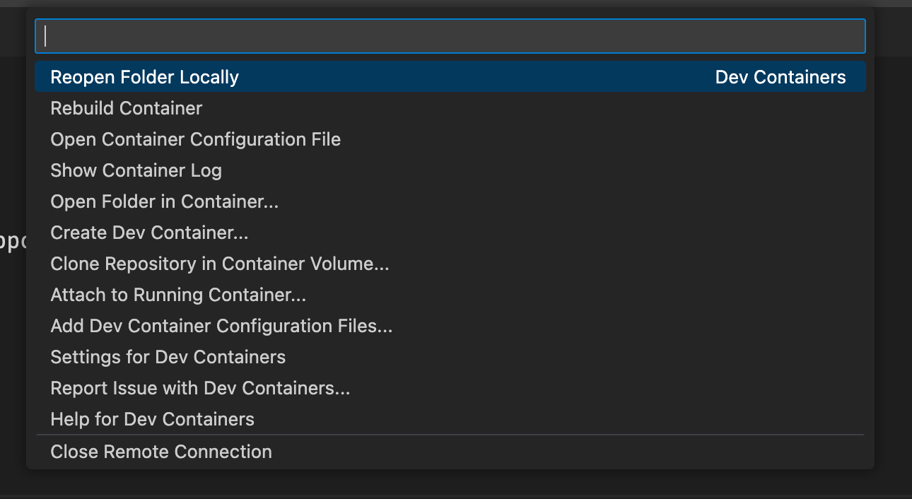

# Sample devcontainer

## Introduction

This repository is set up for development with [GitHub Codespaces](https://docs.github.com/en/codespaces/setting-up-your-project-for-codespaces/introduction-to-dev-containers) and VS Code [Dev Containers](https://code.visualstudio.com/docs/remote/containers).


## Included Utilities

- Docker-in-Docker (with Docker Compose v2 support)
- Helm
- KinD (Kubernetes in Docker)
- kubectl
- Azure CLI

## What now?
Fire up the devcontainer



Once it has started, from the command line run

```bash
kind cluster create
```

You now have a kubernetes cluster running in Kind. Interact with it using `kubectl` commands.

### Deploy

```bash
kubectl apply -f base/deployment.yaml
```

You can also deploy using [kustomize](https://kustomize.io/) to leverage templates and [dev](./overlays/dev/increase_replicas.yaml) and [prod](./overlays/prod/increase_replicas.yaml) values patching.

```bash
kubectl apply -k overlays/dev
```
or

```bash
kubectl apply -k overlays/prod
```
